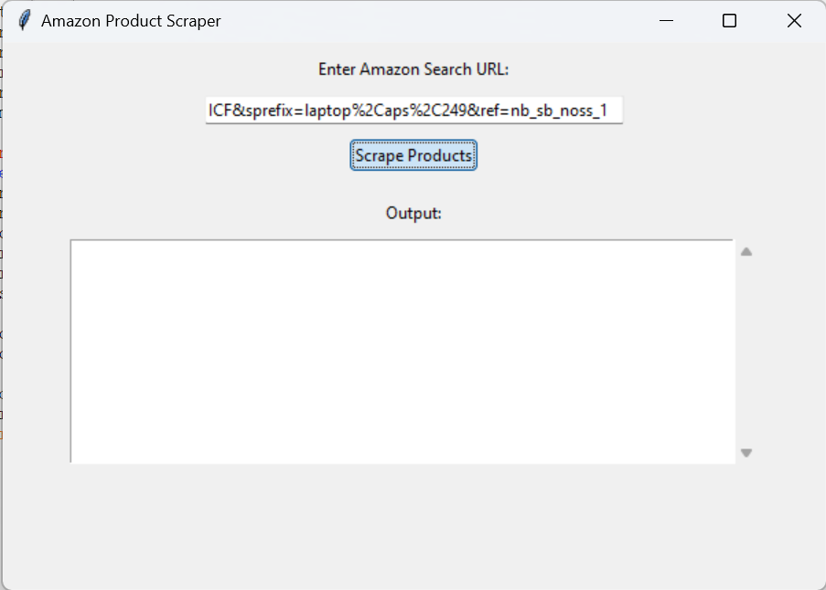

# PRODIGY_SD_05
# Web Scraping Program

## Hello Users!!!

Welcome to the Web Scraping program. This program is created using Python programming language and utilizes the Selenium library along with WebDriver Manager and CSV for scraping details like product names, prices, and ratings from Amazon. The scraped data is stored in a structured format in a CSV file. Below are the images demonstrating the deployed code.
## Example link for scrapping
You can use this link for scraping: https://www.amazon.in/s?k=laptop&crid=15QQ8A7CXHICF&sprefix=laptop%2Caps%2C249&ref=nb_sb_noss_1
if doesn't work Please adjust the code according to the class name or CSS selector that appears when the website is in inspect mode.

### Table of Contents
- [Initial Page](#initial-page)
- [Entering Website Link](#entering-website-link)
- [Storing CSV File](#storing-csv-file)
- [Scraping Success](#scraping-success)
- [Viewing Scraped Data](#viewing-scraped-data)

### Initial Page

This is the initial page displayed when the program runs.

### Entering Website Link

This image shows the webpage where the user enters the website link to be scraped.

### Storing CSV File

This image shows the prompt asking the user to specify the location to store the CSV file.

### Scraping Success

This image indicates that the data has been successfully scraped.

### Viewing Scraped Data

This image shows the scraped data opened in Excel from the CSV file.

## External Packages Used
- Selenium
- WebDriver Manager
- CSV

Make sure to install the required packages before running the program:
```bash
pip install selenium webdriver_manager
